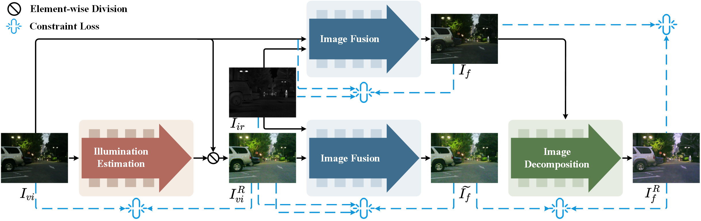

<h1 align="center">[IEEE Transactions on Multimedia 2026] ULightIF</h1>

---

<p align="center">
  <em>ULightIF: Unsupervised Low Light Infrared and Visible Image Fusion Method</em>
</p>

<p align="center">
  <a href="https://github.com/cmuhang/ULightIF" style="text-decoration:none;">
    
  </a>
  <a href="YOUR_IEEE_XPLORE_LINK" style="text-decoration:none; margin-left:8px;">
    
  </a>
</p>


<p align="center">
  
</p>

---

## 🙌 1 Introduction
* This is the official implementation of our paper titled "ULightIF: Unsupervised Low Light Infrared and Visible Image Fusion Method". This paper has been accepted by IEEE Transactions on Multimedia.
* If you have any question about this code, feel free to reach me(cmuhang@163.com)
---


## 🌐 2 Prepare Your Dataset
Please download the datasets from the following links: [MSRS](https://github.com/Linfeng-Tang/MSRS) | [LLVIP](https://bupt-ai-cz.github.io/LLVIP/) | [M3FD](https://github.com/dlut-dimt/TarDAL).

Download the corresponding datasets following their official instructions, and then modify the dataset paths in the `options.py` configuration file.


---
## 🛠️ 3 Pretrained Weights
Please download the weights and place them in the `weights` folder.

The pretrained weights are available at [Google Drive]() | [Baidu Drive]() (code: ULightIF).

---


## 🚀 4 Usage

To facilitate the open-source release, we refactored the codebase using PyTorch Lightning, improving readability and maintainability. Accordingly, this repository provides two testing scripts:
- `test_p.py`: reproduces the results in the paper.
- `test.py`: evaluates models trained with the refactored training pipeline.


### 📖 4.1 Training

Before training, please download and prepare the dataset and configure the training settings in `options.py`. Then run:
```bash
python train.py
```

### 🏊 4.2 Testing

To reproduce the results reported in the paper, run:

```bash
python test_p.py
```

To test your own trained model, run:
```bash
python test.py
```

---


## Citation
If you find our work useful for your research, please cite our paper.

```

```


---

## Related Work
```
@ARTICLE{cheng2025fdfuse,
  author={Cheng, Muhang and Huang, Haiyan and Liu, Xiangyu and Mo, Hongwei and Wu, Songling and Zhao, Xiongbo},
  journal={IEEE Transactions on Instrumentation and Measurement}, 
  title={FDFuse: Infrared and Visible Image Fusion Based on Feature Decomposition}, 
  year={2025},
  volume={74},
  number={},
  pages={1-13},
  doi={10.1109/TIM.2025.3551460}}
```